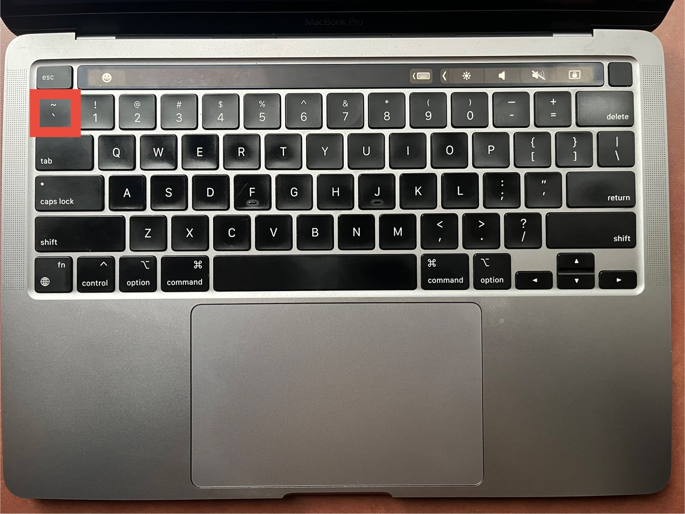

# Asking Questions

This course is *question-driven*, we need you to ask questions. Whether it's posting questions on Discord, booking a 1-on-1 with a TA, or coming to Office Hours; we just have 1 rule: **you're only allowed to get stuck for 15 minutes before writing up a question.**

## Why?

1. Writing out what you’re struggling with will help you solve it yourself
2. Writing well is an essential component of succeeding as a technologist (remote work, StackOverflow, GitHub, Chat GPT, etc.)

<!-- TODO: write up practical examples of good vs bad questions -->
## 5 Step Framework for Writing Excellent Questions

1. State the problem you’re working on
2. What is your code doing right now?
3. What do you want it to be doing instead?
4. Copy-paste the snippet(s) of code that you think are relevant.
5. Describe what you’ve tried so far to resolve.

^ Please use this template when asking questions on Discord. This helps us understand what you're struggling with to give you better answers!

## Putting code in your Questions

You will often be sharing code snippets in your questions (Discord, GitHub, etc.). To help us read your code, please format your code snippets using the backtick key (`) on your keyboard.



Here is my code without the backtick: my_string = "Hello, world!"

Here is my code *with* the backtick: `my_string = "Hello, world!"`

See how much easier that is to read?

If you have a multi-line code snippet you can use 3 backticks (```) to create a "[Fenced Code Block](https://www.markdownguide.org/extended-syntax/#fenced-code-blocks).

You can even tell it which language you are using to get [Syntax Highlighting](https://www.markdownguide.org/extended-syntax/#syntax-highlighting).

\`\`\`ruby

my_name = "Ian"

\`\`\`

and it will render beautifully like this:

```ruby
my_name = "Ian"
```

Isn't that nice?

This is the #1 way to impress your instructors and TAs when asking questions. It makes it much easier to help when you ask a question.  

## Conclusion

It's very important to ask questions as you work through this course. In the world of AI and Chat GPT, articualating your thoughts in writing is a super power. We encourage you to write down your questions, follow the [5 step framework for writing excellent questions](#5-step-framework-for-writing-excellent-questions), and use [backticks for code snippets](#putting-code-in-your-questions).

## Resources

- [lock-before-key principle](https://mkremins.github.io/blog/doors-headaches-intellectual-need/)
- [Steve Jobs on 'asking for help'](https://www.youtube.com/watch?v=zkTf0LmDqKI)
- [StackOverflow guide to asking questions](https://stackoverflow.com/help/how-to-ask). StackOverflow users are notorious curmudgeons, but often give great answers. This guide gives good advice on asking questions in a way to get helpful answers.
